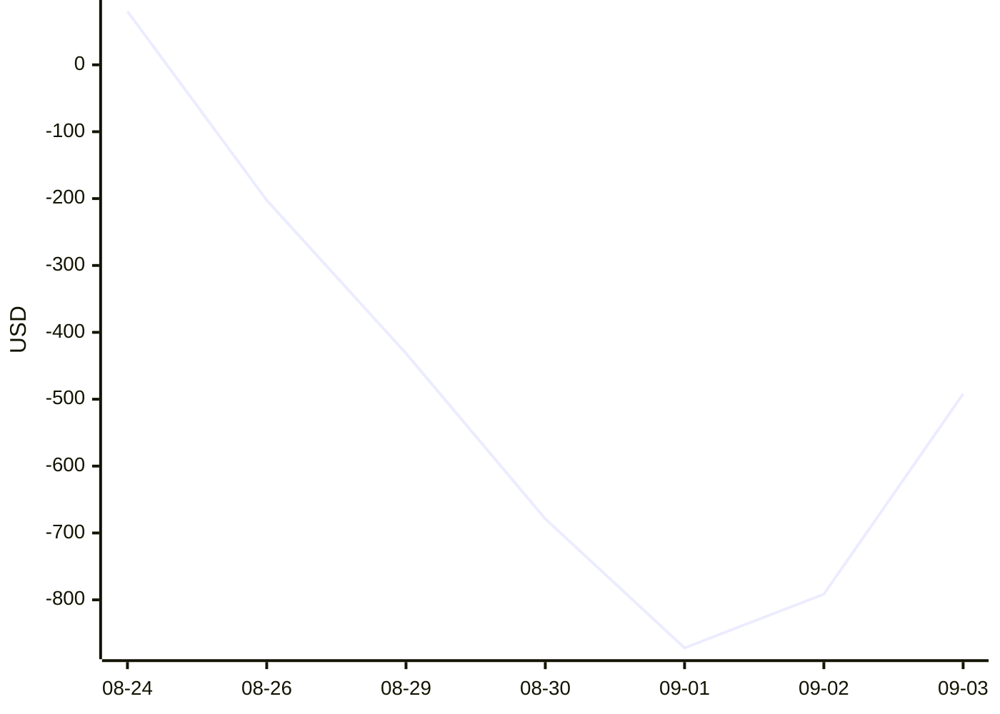

# 📈 Paper-trading dashboard

_Updated 2026-09-04 17:56 UTC · bankroll $1000 · stations KNYC · KMDW · KAUS · KLAX · KSFO · KDEN · KPHL · no live orders placed_

| Realized P&L | ROI (on stake) | Win rate | Closed | Open | Open stake |
|---:|---:|---:|---:|---:|---:|
| **$-492.02** | **-21.6%** | **32%** | 34 | 1 | $61 |

### By station

| Station | Positions | Open | Closed | Realized P&L |
|:--|--:|--:|--:|--:|
| KAUS | 7 | 0 | 7 | $-273.70 |
| KDEN | 1 | 0 | 1 | $-102.15 |
| KLAX | 3 | 0 | 3 | $-191.56 |
| KMDW | 6 | 1 | 5 | $+195.89 |
| KNYC | 7 | 0 | 7 | $+47.79 |
| KPHL | 2 | 0 | 2 | $-212.57 |
| KSFO | 9 | 0 | 9 | $+44.28 |

### Cumulative realized P&L

### Open positions

| Station | Settles | Bucket | Side | Price | Qty | Type |
|:--|:--|:--|:--|--:|--:|:--|
| KMDW | 2026-09-04 | ≤88° | YES | $0.06 | 1023 | taker |

### Recently settled

| Station | Day | Bucket | Side | Settled high | P&L |
|:--|:--|:--|:--|--:|--:|
| KMDW | 2026-08-26 | 81–82° | YES | 85° | $-78.56 |
| KLAX | 2026-08-26 | 82–83° | YES | 87° | $-23.71 |
| KSFO | 2026-08-26 | ≤71° | YES | 77° | $-74.01 |
| KSFO | 2026-08-29 | 69–70° | NO | 71° | $+54.04 |
| KPHL | 2026-08-29 | ≤80° | YES | 82° | $-106.93 |
| KMDW | 2026-08-29 | 82–83° | NO | 82° | $-71.42 |
| KAUS | 2026-08-29 | 99–100° | NO | 100° | $-104.65 |
| KAUS | 2026-08-30 | 96–97° | YES | 100° | $-39.65 |
| KDEN | 2026-08-30 | 85–86° | NO | 85° | $-102.15 |
| KPHL | 2026-08-30 | 86–87° | NO | 87° | $-105.64 |
| KMDW | 2026-09-01 | 91–92° | YES | 94° | $-62.80 |
| KAUS | 2026-09-01 | 100–101° | NO | 101° | $-58.75 |
| KLAX | 2026-09-01 | 76–77° | NO | 76° | $-71.54 |
| KMDW | 2026-09-02 | 96–97° | NO | 96° | $-40.69 |
| KLAX | 2026-09-02 | 77–78° | NO | 77° | $-96.31 |
| KSFO | 2026-09-02 | 71–72° | NO | 73° | $+217.35 |
| KNYC | 2026-09-03 | ≤82° | YES | 84° | $-105.61 |
| KMDW | 2026-09-03 | 90–91° | NO | 92° | $+449.36 |
| KAUS | 2026-09-03 | 101–102° | NO | 100° | $+52.26 |
| KSFO | 2026-09-03 | 70–71° | YES | 72° | $-96.44 |
