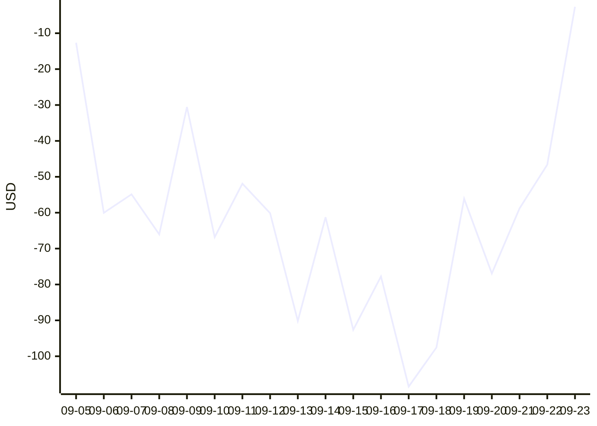

# 📈 Live strategy and paper arms

## What the live bot is doing right now

_Generated from the settings the live loop runs with._

- Trades Kalshi daily high-temperature markets for 8 cities: Central Park, NY, Chicago Midway, IL, San Francisco, CA, Denver, CO, Houston Hobby, TX, Dallas-Fort Worth, TX, Minneapolis, MN, New Orleans, LA.
- Looks for trades at 11:00, 13:00, 15:00 ET, and may place them for 75 minutes after each.
- Bankroll $150. A day that loses more than $40 halts trading until you resume it by hand.
- At most one position per city per day, and no more than 25% of bankroll ($37.50) on any city.
- The model's probability is blended 50% model / 50% market price before deciding.
- Buys only when that blended probability beats the ask by at least 5 points or 35% of the ask, whichever is larger, after fees.
- Never buys below 15¢, and never when the model says the market is wrong by more than 2.5×.
- Rejects a trade that would stop being profitable if the forecast were off by 1°F in either direction or toward the market's own view.
- Sizes at 0.25× Kelly. Orders are immediate-or-cancel at the live order book's ask, capped at what is actually resting there.

**Changes to the live rules**

- `2026-09-06` Real money now trades 8 cities (NYC, Chicago, Dallas, Houston, New Orleans, Minneapolis, Denver, San Francisco): the ones positive under BOTH backtest bounds. The archive forecast is fresher than what a live tick has, so a previous-day-runs bound was added; Austin, LA, Philadelphia, Atlanta, Las Vegas, OKC, Phoenix, Seattle are paper-only until the live model-vs-market score says otherwise.
- `2026-09-06` Daily loss kill-switch raised from $15 to $40: the $15 cap was sized for one trade a day and 16 cities make two to three.
- `2026-09-05` Nine cities added (Houston, Atlanta, Dallas, Las Vegas, Minneapolis, New Orleans, Oklahoma City, Phoenix, Seattle): each passed the live-rules backtest with real-volume fill caps and matched Kalshi's settlement 41 of 41 days. Daily budget now goes to the best-EV trades first.
- `2026-09-04` Forecast-error check loosened from 1.5°F to 1.0°F: it was blocking most of the backtest's profit, and the looser check held up under real hourly volume caps.
- `2026-09-04` Trades only inside three tick slots (11:00, 13:00, 15:00 ET); orders re-priced on the live order book and capped at resting depth before sending.
- `2026-08-27` 15¢ price floor, 2.5x disagreement cap, 50/50 blend with the market price, $15 daily loss kill-switch — after the Aug 25-26 losses.
- `2026-08-25` Live with real money at a $150 canary bankroll.

## Paper arms

_Updated 2026-09-24 15:33 UTC · bankroll $150 per arm · stations KNYC · KMDW · KAUS · KLAX · KSFO · KDEN · KPHL · KHOU · KATL · KDFW · KLAS · KMSP · KMSY · KOKC · KPHX · KSEA · fills at the live book's touch, depth-capped · no live orders placed_

| Arm | Differs from control | Realized P&L | ROI (on stake) | Win rate | Closed | Open |
|:--|:--|---:|---:|---:|---:|---:|
| **control** | live config — Exactly the live rules. Every other arm is judged against this one. | **$-2.62** | -0.5% | 30% | 70 | 0 |
| **no_gate** | robust_delta=0.0 — No forecast-error check at all. Backtest's best result; takes ~3 trades a day. | **$-93.98** | -11.9% | 24% | 116 | 3 |
| **gate_15** | robust_delta=1.5 — The stricter 1.5°F check that was live until Sep 4. | **$+37.26** | +10.8% | 32% | 50 | 0 |
| **model_w1** | model_weight=1.0 — Trusts the model fully, no blending with the market price. | **$-119.97** | -13.1% | 33% | 103 | 3 |
| **model_w025** | model_weight=0.25 — Leans 75% on the market price. Fewest trades, smallest drawdown in backtest. | **$-8.88** | -17.1% | 17% | 12 | 0 |
| **early** | ticks=(15, 17) — Enters only at the 11:00 and 13:00 ET ticks, never the afternoon. | **$+86.04** | +25.2% | 40% | 45 | 0 |
| **w15_025** | w15=0.25 — Trusts the model only 25% at the 11:00 ET tick, where it leans on forecasts alone; 50% later. The only 11:00 setting positive under both backtest bounds. | **$-8.63** | -2.2% | 28% | 54 | 0 |

## Control arm

### By station

| Station | Positions | Open | Closed | Realized P&L |
|:--|--:|--:|--:|--:|
| KATL | 10 | 0 | 10 | $+95.28 |
| KAUS | 2 | 0 | 2 | $-9.85 |
| KDEN | 4 | 0 | 4 | $-7.86 |
| KDFW | 1 | 0 | 1 | $+13.70 |
| KHOU | 5 | 0 | 5 | $-6.08 |
| KLAS | 6 | 0 | 6 | $-13.82 |
| KLAX | 9 | 0 | 9 | $-8.07 |
| KMDW | 4 | 0 | 4 | $-0.93 |
| KMSP | 5 | 0 | 5 | $-4.53 |
| KMSY | 2 | 0 | 2 | $-9.37 |
| KNYC | 4 | 0 | 4 | $-22.08 |
| KOKC | 6 | 0 | 6 | $+11.58 |
| KPHL | 1 | 0 | 1 | $-15.55 |
| KPHX | 3 | 0 | 3 | $+5.69 |
| KSEA | 3 | 0 | 3 | $+7.97 |
| KSFO | 5 | 0 | 5 | $-38.70 |

### Cumulative realized P&L

### Recently settled

| Station | Day | Bucket | Side | Settled high | P&L |
|:--|:--|:--|:--|--:|--:|
| KLAX | 2026-09-19 | ≤77° | YES | 77° | $+4.29 |
| KATL | 2026-09-19 | ≤91° | NO | 92° | $+50.46 |
| KNYC | 2026-09-19 | 69–70° | NO | 69° | $-7.23 |
| KHOU | 2026-09-19 | 92–93° | NO | 93° | $-6.06 |
| KMSP | 2026-09-20 | 67–68° | YES | 66° | $-11.07 |
| KPHX | 2026-09-20 | 101–102° | NO | 104° | $+19.96 |
| KLAX | 2026-09-20 | ≤75° | YES | 78° | $-9.51 |
| KATL | 2026-09-20 | ≤87° | YES | 89° | $-11.75 |
| KMSY | 2026-09-20 | 91–92° | NO | 91° | $-8.45 |
| KLAX | 2026-09-21 | 77–78° | NO | 77° | $-12.59 |
| KHOU | 2026-09-21 | 94–95° | NO | 93° | $+13.12 |
| KATL | 2026-09-21 | 91–92° | NO | 90° | $+17.94 |
| KDEN | 2026-09-21 | 74–75° | NO | 75° | $-0.33 |
| KLAX | 2026-09-22 | 75–76° | YES | 77° | $-7.76 |
| KLAS | 2026-09-22 | 90–91° | NO | 89° | $+6.23 |
| KDFW | 2026-09-22 | 97–98° | NO | 96° | $+13.70 |
| KDEN | 2026-09-23 | ≤75° | NO | 72° | $-13.27 |
| KATL | 2026-09-23 | ≤79° | NO | 82° | $+20.25 |
| KLAX | 2026-09-23 | 80–81° | NO | 78° | $+18.24 |
| KOKC | 2026-09-23 | 91–92° | NO | 93° | $+18.78 |
