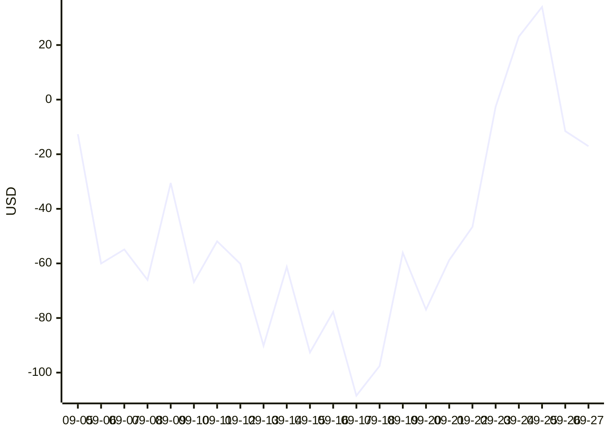

# 📈 Live strategy and paper arms

## What the live bot is doing right now

_Generated from the settings the live loop runs with._

- Trades Kalshi daily high-temperature markets for 8 cities: Central Park, NY, Chicago Midway, IL, San Francisco, CA, Denver, CO, Houston Hobby, TX, Dallas-Fort Worth, TX, Minneapolis, MN, New Orleans, LA.
- Looks for trades at 11:00, 13:00, 15:00 ET, and may place them for 75 minutes after each.
- Bankroll $150. A day that loses more than $40 halts trading until you resume it by hand.
- At most one position per city per day, and no more than 25% of bankroll ($37.50) on any city.
- The model's probability is blended 50% model / 50% market price before deciding.
- Buys only when that blended probability beats the ask by at least 5 points or 35% of the ask, whichever is larger, after fees.
- Never buys below 15¢, and never when the model says the market is wrong by more than 2.5×.
- Rejects a trade that would stop being profitable if the forecast were off by 1°F in either direction or toward the market's own view.
- Sizes at 0.25× Kelly. Orders are immediate-or-cancel at the live order book's ask, capped at what is actually resting there.

**Changes to the live rules**

- `2026-09-06` Real money now trades 8 cities (NYC, Chicago, Dallas, Houston, New Orleans, Minneapolis, Denver, San Francisco): the ones positive under BOTH backtest bounds. The archive forecast is fresher than what a live tick has, so a previous-day-runs bound was added; Austin, LA, Philadelphia, Atlanta, Las Vegas, OKC, Phoenix, Seattle are paper-only until the live model-vs-market score says otherwise.
- `2026-09-06` Daily loss kill-switch raised from $15 to $40: the $15 cap was sized for one trade a day and 16 cities make two to three.
- `2026-09-05` Nine cities added (Houston, Atlanta, Dallas, Las Vegas, Minneapolis, New Orleans, Oklahoma City, Phoenix, Seattle): each passed the live-rules backtest with real-volume fill caps and matched Kalshi's settlement 41 of 41 days. Daily budget now goes to the best-EV trades first.
- `2026-09-04` Forecast-error check loosened from 1.5°F to 1.0°F: it was blocking most of the backtest's profit, and the looser check held up under real hourly volume caps.
- `2026-09-04` Trades only inside three tick slots (11:00, 13:00, 15:00 ET); orders re-priced on the live order book and capped at resting depth before sending.
- `2026-08-27` 15¢ price floor, 2.5x disagreement cap, 50/50 blend with the market price, $15 daily loss kill-switch — after the Aug 25-26 losses.
- `2026-08-25` Live with real money at a $150 canary bankroll.

## Paper arms

_Updated 2026-10-03 19:12 UTC · bankroll $150 per arm · stations KNYC · KMDW · KAUS · KLAX · KSFO · KDEN · KPHL · KHOU · KATL · KDFW · KLAS · KMSP · KMSY · KOKC · KPHX · KSEA · fills at the live book's touch, depth-capped · no live orders placed_

| Arm | Differs from control | Realized P&L | ROI (on stake) | Win rate | Closed | Open |
|:--|:--|---:|---:|---:|---:|---:|
| **control** | live config — Exactly the live rules. Every other arm is judged against this one. | **$-17.08** | -2.6% | 29% | 87 | 27 |
| **no_gate** | robust_delta=0.0 — No forecast-error check at all. Backtest's best result; takes ~3 trades a day. | **$-66.73** | -6.9% | 25% | 136 | 45 |
| **gate_15** | robust_delta=1.5 — The stricter 1.5°F check that was live until Sep 4. | **$+2.01** | +0.5% | 29% | 58 | 11 |
| **model_w1** | model_weight=1.0 — Trusts the model fully, no blending with the market price. | **$-231.97** | -19.7% | 32% | 125 | 47 |
| **model_w025** | model_weight=0.25 — Leans 75% on the market price. Fewest trades, smallest drawdown in backtest. | **$-28.71** | -30.7% | 14% | 21 | 1 |
| **early** | ticks=(15, 17) — Enters only at the 11:00 and 13:00 ET ticks, never the afternoon. | **$+14.16** | +2.4% | 33% | 72 | 6 |
| **w15_025** | w15=0.25 — Trusts the model only 25% at the 11:00 ET tick, where it leans on forecasts alone; 50% later. The only 11:00 setting positive under both backtest bounds. | **$-27.92** | -5.3% | 26% | 68 | 20 |

## Control arm

### By station

| Station | Positions | Open | Closed | Realized P&L |
|:--|--:|--:|--:|--:|
| KATL | 16 | 3 | 13 | $+111.47 |
| KAUS | 3 | 0 | 3 | $-16.62 |
| KDEN | 7 | 3 | 4 | $-7.86 |
| KDFW | 3 | 2 | 1 | $+13.70 |
| KHOU | 7 | 2 | 5 | $-6.08 |
| KLAS | 6 | 0 | 6 | $-13.82 |
| KLAX | 12 | 2 | 10 | $-16.60 |
| KMDW | 11 | 4 | 7 | $+32.46 |
| KMSP | 9 | 3 | 6 | $-10.83 |
| KMSY | 4 | 0 | 4 | $-24.84 |
| KNYC | 4 | 0 | 4 | $-22.08 |
| KOKC | 11 | 2 | 9 | $+13.73 |
| KPHL | 3 | 2 | 1 | $-15.55 |
| KPHX | 4 | 1 | 3 | $+5.69 |
| KSEA | 7 | 1 | 6 | $-21.15 |
| KSFO | 7 | 2 | 5 | $-38.70 |

### Cumulative realized P&L

```mermaid
xychart-beta
  x-axis ["09-05", "09-06", "09-07", "09-08", "09-09", "09-10", "09-11", "09-12", "09-13", "09-14", "09-15", "09-16", "09-17", "09-18", "09-19", "09-20", "09-21", "09-22", "09-23", "09-24", "09-25", "09-26", "09-27"]
  y-axis "USD"
  line [-12.66, -60.03, -54.88, -66.03, -30.54, -66.82, -51.90, -60.13, -90.16, -61.28, -92.62, -77.76, -108.45, -97.57, -56.11, -76.93, -58.79, -46.62, -2.62, 23.09, 33.97, -11.53, -17.08]
```

### Open positions

| Station | Settles | Bucket | Side | Price | Qty |
|:--|:--|:--|:--|--:|--:|
| KSEA | 2026-09-29 | 62–63° | NO | $0.33 | 25 |
| KDEN | 2026-09-30 | 65–66° | YES | $0.26 | 1 |
| KHOU | 2026-10-01 | ≤89° | NO | $0.45 | 33 |
| KMSP | 2026-10-01 | 65–66° | NO | $0.20 | 27 |
| KOKC | 2026-10-01 | 79–80° | YES | $0.23 | 37 |
| KPHL | 2026-10-01 | 82–83° | NO | $0.39 | 38 |
| KSFO | 2026-10-01 | 75–76° | YES | $0.18 | 41 |
| KDFW | 2026-10-02 | 77–78° | YES | $0.28 | 53 |
| KMDW | 2026-10-02 | 65–66° | NO | $0.19 | 41 |
| KMSP | 2026-10-02 | 64–65° | NO | $0.45 | 33 |
| KOKC | 2026-10-02 | 68–69° | NO | $0.31 | 48 |
| KPHL | 2026-10-02 | 84–85° | YES | $0.16 | 28 |
| KSFO | 2026-10-02 | ≤76° | NO | $0.39 | 5 |
| KATL | 2026-10-03 | 86–87° | NO | $0.46 | 11 |
| KDEN | 2026-10-03 | 83–84° | NO | $0.31 | 15 |
| KDFW | 2026-10-03 | 74–75° | NO | $0.49 | 30 |
| KHOU | 2026-10-03 | 86–87° | NO | $0.48 | 31 |
| KLAX | 2026-10-03 | ≥99° | NO | $0.31 | 27 |
| KMDW | 2026-10-03 | 68–69° | NO | $0.43 | 34 |
| KMSP | 2026-10-03 | 66–67° | YES | $0.27 | 27 |

### Recently settled

| Station | Day | Bucket | Side | Settled high | P&L |
|:--|:--|:--|:--|--:|--:|
| KATL | 2026-09-23 | ≤79° | NO | 82° | $+20.25 |
| KLAX | 2026-09-23 | 80–81° | NO | 78° | $+18.24 |
| KOKC | 2026-09-23 | 91–92° | NO | 93° | $+18.78 |
| KMSY | 2026-09-24 | 89–90° | NO | 89° | $-8.90 |
| KLAX | 2026-09-24 | ≤77° | YES | 78° | $-8.53 |
| KOKC | 2026-09-24 | 93–94° | NO | 92° | $+17.57 |
| KMDW | 2026-09-24 | 68–69° | YES | 69° | $+25.57 |
| KMDW | 2026-09-25 | 66–67° | NO | 64° | $+17.57 |
| KATL | 2026-09-25 | ≤75° | YES | 77° | $-5.92 |
| KSEA | 2026-09-25 | 61–62° | NO | 62° | $-0.30 |
| KOKC | 2026-09-25 | 91–92° | NO | 92° | $-0.47 |
| KMDW | 2026-09-26 | 66–67° | YES | 68° | $-9.75 |
| KMSP | 2026-09-26 | ≤61° | NO | 61° | $-6.30 |
| KSEA | 2026-09-26 | 63–64° | NO | 64° | $-14.64 |
| KATL | 2026-09-26 | 81–82° | NO | 81° | $-8.24 |
| KMSY | 2026-09-26 | 86–87° | NO | 87° | $-6.57 |
| KATL | 2026-09-27 | 82–83° | NO | 81° | $+30.35 |
| KAUS | 2026-09-27 | 98–99° | NO | 98° | $-6.77 |
| KSEA | 2026-09-27 | 65–66° | NO | 65° | $-14.18 |
| KOKC | 2026-09-27 | 93–94° | NO | 93° | $-14.95 |
